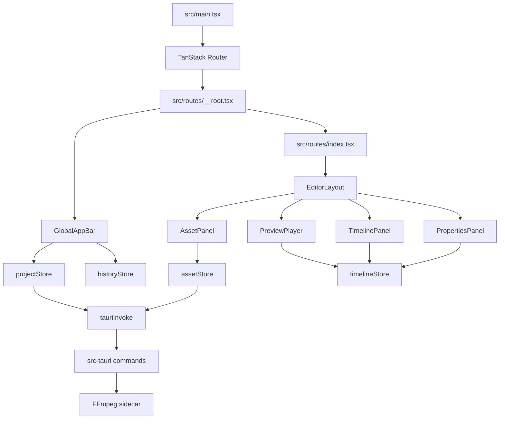

# Video Editor Project Map

> 역할: 이 파일은 저장소 전체 파일 구조를 안내하는 루트 프로젝트 맵이다. 에이전트와 기여자는 코드 검색을 시작하기 전에 이 파일을 먼저 읽고, 여기의 경로 지침으로 대상 파일을 좁힌 뒤 필요한 경우에만 `rg` 등으로 세부 검색한다.

---

## Freshness Rules

- 이 파일은 `graphify-out/GRAPH_REPORT.md`처럼 항상 최신 상태를 유지한다.
- 파일, 폴더, 라우트, Tauri command, store, 주요 컴포넌트, 빌드 스크립트, 문서/스킬 구조가 추가·이동·삭제되면 같은 작업에서 이 파일을 갱신한다.
- 이 파일과 실제 소스가 다르면 실제 소스를 기준으로 수정하고, 불일치 원인을 작업 결과에 기록한다.
- `src/routeTree.gen.ts`, `dist/`, `node_modules/`, `src-tauri/target/`, Tauri generated schemas, 아이콘 바이너리는 구조 판단의 출발점으로 사용하지 않는다.

## Agent Navigation Protocol

1. 작업 전 `AGENTS.md`와 이 `PROJECT_MAP.md`를 먼저 읽는다.
2. 파일 위치를 찾을 때는 이 맵의 "Where To Go First"를 우선 적용한다.
3. 맵에 없는 세부 구현을 찾을 때만 `rg`/`rg --files`로 검색한다.
4. 구조 변경을 수행했다면 `PROJECT_MAP.md`, 관련 `.github/skills/**`, `.github/instructions/**`, `docs/Guide.md`, `TODO.md`를 함께 검토한다.
5. 아키텍처 이해가 더 필요하고 `graphify-out/GRAPH_REPORT.md`가 존재하면, 이 맵을 읽은 뒤 graphify 리포트를 보조 자료로 확인한다.

---

## System Shape

- App type: React 19 + TypeScript + Tauri 2 desktop video editor.
- UI: MUI v7.
- Routing: TanStack Router file routes under `src/routes`.
- State: Zustand stores under `src/store`.
- Media preview: HTML5 media elements + Canvas compositor.
- Timeline UI: dnd-kit timeline panel; React Flow skill applies to graph/timeline canvas work.
- Backend: Rust Tauri commands under `src-tauri/src/commands`.
- Media processing: FFmpeg/ffprobe sidecars, called only for import metadata/thumbnail and export-related backend commands.

---

## Where To Go First

| Task | Start Here | Then Check |
|---|---|---|
| App shell, menus, project open/save, shortcuts | `src/components/app/GlobalAppBar.tsx` | `src/routes/__root.tsx`, `src/lib/useGlobalShortcuts.ts`, `src/store/projectStore.ts` |
| Main editor layout | `src/components/EditorLayout.tsx` | `src/components/assets/AssetPanel.tsx`, `src/components/preview/PreviewPlayer.tsx`, `src/components/timeline/TimelinePanel.tsx`, `src/components/properties/PropertiesPanel.tsx` |
| Asset import/drop/thumbnail list | `src/components/assets/AssetPanel.tsx` | `src/store/assetStore.ts`, `src/lib/mediaSource.ts`, `src-tauri/src/commands/asset.rs` |
| Canvas preview/rendering | `src/components/preview/PreviewPlayer.tsx` | `src/components/preview/canvasCompositor.ts`, `src/components/preview/canvasCompositor.test.ts`, `src/store/timelineStore.ts` |
| Export dialog/progress | `src/components/preview/ExportDialog.tsx` | `src-tauri/src/commands/ffmpeg.rs`, `.github/skills/ffmpeg-integration/SKILL.md` |
| Timeline tracks/clips/layers | `src/components/timeline/TimelinePanel.tsx` | `src/store/timelineStore.ts`, `.github/skills/timeline-editor/SKILL.md` |
| Right properties/tool options | `src/components/properties/PropertiesPanel.tsx` | `src/store/toolStore.ts`, `src/store/timelineStore.ts` |
| Tool toolbar | `src/components/toolbar/ToolPanel.tsx` | `src/store/toolStore.ts` |
| Settings screen | `src/routes/settings.tsx` | `src/components/settings/SettingsPage.tsx`, `src/store/settingsStore.ts` |
| Project create/open/save format | `src/store/projectStore.ts` | `src/lib/projectSerialization.ts`, `src/components/project/NewProjectDialog.tsx`, `src-tauri/src/commands/project.rs` |
| Undo/redo history | `src/store/historyStore.ts` | `src/lib/withHistory.ts`, `src/components/app/GlobalAppBar.tsx` |
| Tauri IPC wrapper | `src/lib/invoke.ts` | `src-tauri/src/commands/common.rs`, `src-tauri/src/lib.rs` |
| Rust command wiring | `src-tauri/src/lib.rs` | `src-tauri/src/commands/mod.rs`, `src-tauri/src/commands/*.rs` |
| Build/chunk warnings | `vite.config.ts` | `.agents/skills/project-structure-review-agent/SKILL.md`, `src/routes/*`, lazy component boundaries |
| Documentation/agent rules | `AGENTS.md` | `.github/copilot-instructions.md`, `.github/instructions/*.md`, `.github/skills/**/SKILL.md`, `.agents/skills/**/SKILL.md` |

---

## Root Files

| Path | Role |
|---|---|
| `AGENTS.md` | Root agent and contributor guide. Defines mandatory project rules and Codex/Copilot procedure. |
| `PROJECT_MAP.md` | This structure map. Must be checked before code search and kept fresh with structure changes. |
| `TODO.md` | Development phase checklist and review backlog. Completed work must be checked immediately. |
| `MasterPlan.md` | Original product/development plan. Use as historical phase context. |
| `package.json` | Frontend scripts and dependency list. |
| `pnpm-lock.yaml` | Package lockfile. Do not hand-edit. |
| `vite.config.ts` | Vite/Tauri dev server and build config. |
| `tsconfig.json` | TypeScript compiler config. |
| `biome.json` | Biome formatting/lint config. |
| `index.html` | HTML shell and preload splash markup. |

---

## Frontend Map

### Entrypoint And Routing

| Path | Role |
|---|---|
| `src/main.tsx` | React root creation, theme provider, app loader, TanStack router provider. |
| `src/routes/__root.tsx` | Thin root route shell. Lazy-loads app bar and root-level dialogs. |
| `src/routes/index.tsx` | `/` route. Lazy-loads `EditorLayout`. |
| `src/routes/settings.tsx` | `/settings` route. Lazy-loads settings page body. |
| `src/routeTree.gen.ts` | Generated TanStack route tree. Never edit manually. |
| `src/vite-env.d.ts` | Vite type declarations. |

### App Shell And Layout

| Path | Role |
|---|---|
| `src/components/app/GlobalAppBar.tsx` | File menu, recent projects, save/open, undo/redo, export/settings buttons, close guard. |
| `src/components/EditorLayout.tsx` | Main editor split layout, dnd-kit context, drag overlay, asset/timeline/preview/properties composition. |
| `src/components/AppLoader.tsx` | React boot progress UI paired with HTML splash. |
| `src/components/AppThemeProvider.tsx` | MUI theme creation from settings store. |
| `src/components/common/LayoutResizer.tsx` | Reusable splitter/resizer handle. |
| `src/components/common/ResizableDialog.tsx` | Required dialog wrapper for all popups. |

### Feature Components

| Path | Role |
|---|---|
| `src/components/assets/AssetPanel.tsx` | Asset list, Tauri import, browser fallback file add/drop, draggable assets. |
| `src/components/preview/PreviewPlayer.tsx` | Canvas preview player, media sync, playback controls, canvas editing interactions. |
| `src/components/preview/canvasCompositor.ts` | Pure compositor helpers for media/text/shape drawing, hit testing, fit calculations. |
| `src/components/preview/canvasCompositor.test.ts` | Vitest coverage for compositor behavior. |
| `src/components/preview/ExportDialog.tsx` | Export options/progress dialog. |
| `src/components/timeline/TimelinePanel.tsx` | Timeline ruler, tracks, clips, layer panel, trim, zoom, layer reorder. |
| `src/components/properties/PropertiesPanel.tsx` | Right sidebar for selected clip/tool/canvas properties and crop edit controls. |
| `src/components/toolbar/ToolPanel.tsx` | Vertical tool selector. |
| `src/components/project/NewProjectDialog.tsx` | New project creation dialog. |
| `src/components/settings/SettingsPage.tsx` | Settings page content for theme, zoom, snap interval. |

### Stores

| Path | Role |
|---|---|
| `src/store/timelineStore.ts` | Canonical timeline state: tracks, clips, canvas dimensions, clip editing actions. |
| `src/store/assetStore.ts` | Asset list state and load/clear actions. |
| `src/store/projectStore.ts` | Project metadata, recent projects, dirty state, project load/save IPC helpers. |
| `src/store/historyStore.ts` | Undo/redo snapshot stacks. |
| `src/store/settingsStore.ts` | Theme/settings state. |
| `src/store/toolStore.ts` | Active editing tool and crop edit mode. |

### Libraries

| Path | Role |
|---|---|
| `src/lib/invoke.ts` | Only approved Tauri IPC wrapper and runtime detection helpers. |
| `src/lib/errors.ts` | Shared frontend `AppError` normalization. |
| `src/lib/mediaSource.ts` | Browser/Tauri displayable media URL conversion. |
| `src/lib/projectSerialization.ts` | Project JSON serialization from stores. |
| `src/lib/storageKeys.ts` | Central localStorage key constants. |
| `src/lib/useStickyState.ts` | Sticky localStorage-backed state hook. |
| `src/lib/useGlobalShortcuts.ts` | Global keyboard shortcut registration. |
| `src/lib/withHistory.ts` | History wrapper for timeline-changing actions. |

---

## Backend Map

| Path | Role |
|---|---|
| `src-tauri/src/main.rs` | Tauri binary entrypoint. |
| `src-tauri/src/lib.rs` | Tauri app builder, plugin setup, command registration. |
| `src-tauri/src/commands/mod.rs` | Command module exports. |
| `src-tauri/src/commands/common.rs` | Shared `AppError`, event constants, helper types. |
| `src-tauri/src/commands/asset.rs` | Asset import, ffprobe metadata, thumbnail generation. |
| `src-tauri/src/commands/ffmpeg.rs` | FFmpeg export command and progress events. |
| `src-tauri/src/commands/project.rs` | Project file save/load commands. |
| `src-tauri/Cargo.toml` | Rust dependencies and Tauri build config. |
| `src-tauri/build.rs` | Tauri build script. |
| `src-tauri/tauri.conf.json` | Tauri app config, window, bundle, sidecar config. |
| `src-tauri/capabilities/default.json` | Tauri permission/capability rules. |
| `src-tauri/gen/schemas/*` | Generated Tauri schemas. Do not use as structure source. |
| `src-tauri/icons/**` | Generated app icons. |

---

## Scripts And Automation

| Path | Role |
|---|---|
| `scripts/vscode-vite-dev.mjs` | Idempotent Vite dev server helper for VS Code/Tauri debug. |
| `scripts/download-ffmpeg.mjs` | FFmpeg/ffprobe sidecar downloader. |
| `scripts/setup-windows.mjs` | Windows setup helper. |
| `scripts/app-icon.svg` | Source SVG for app icon generation. |
| `.github/workflows/release.yml` | Release workflow. |

---

## Documentation And Agent Rules

| Path | Role |
|---|---|
| `docs/Guide.md` | User/developer guide for preview behavior, build chunk splitting, layer panel, playback. |
| `.github/copilot-instructions.md` | Shared high-level rules for Copilot and Codex. |
| `.github/instructions/backend.instructions.md` | Rust/Tauri backend path rules. |
| `.github/instructions/ui.instructions.md` | UI, routes, preview, dialog, state rules. |
| `.github/instructions/charts.instructions.md` | Timeline-specific rules. |
| `.github/instructions/tables.instructions.md` | Asset panel rules. |
| `.github/instructions/docs.instructions.md` | Documentation synchronization rules. |
| `.github/skills/tauri-backend/SKILL.md` | Tauri backend workflow. |
| `.github/skills/timeline-editor/SKILL.md` | Timeline/clip/canvas editing workflow. |
| `.github/skills/ffmpeg-integration/SKILL.md` | FFmpeg workflow. |
| `.github/skills/ui-conventions/SKILL.md` | UI/dialog/layout conventions. |
| `.github/skills/rust-skills/SKILL.md` | Rust coding workflow. |
| `.github/skills/react-best-practices/SKILL.md` | React performance and correctness guidance. |
| `.agents/skills/project-structure-review-agent/SKILL.md` | Structure, large-file, and large-chunk review workflow. |
| `.agents/skills/code-review-agent/SKILL.md` | Code review checklist. |
| `.agents/skills/memory-leak-review-agent/SKILL.md` | Cleanup/resource leak review workflow. |
| `.agents/skills/security-review-agent/SKILL.md` | Security review workflow. |
| `.agents/skills/react-flow/SKILL.md` | React Flow workflow and references. |

---

## Data And Control Flow

---

## Update Checklist

When changing structure, check these before finishing:

- Did a file/folder move or new feature directory get added? Update "Frontend Map", "Backend Map", or "Documentation And Agent Rules".
- Did a route change? Update "Entrypoint And Routing" and `.github/instructions/ui.instructions.md` if rules changed.
- Did a Tauri command change? Update "Backend Map" and relevant backend/FFmpeg skills.
- Did a store or state owner change? Update "Stores" and relevant domain skill.
- Did build chunk strategy change? Update "Where To Go First", `docs/Guide.md`, and project-structure-review-agent skill.
- Did this file become stale while working? Patch it in the same change before final response.
