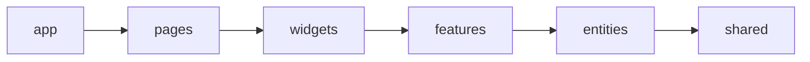

# FSD 및 Large-file 점진 마이그레이션 리뷰

> 상태: **리뷰/백로그 기준 문서**. 이 문서 작성 작업에서는 파일 이동이나 대규모 리팩터링을 수행하지 않는다.
> 기준일: 2026-07-26

## 1. 결론

현재 구조를 한 번에 FSD로 옮기면 import 경계 변경과 동작 변경이 동시에 발생해 회귀 원인을 분리하기 어렵다. 먼저 현재 경로 안에서 큰 파일의 순수 로직과 UI 경계를 작게 추출하고, 회귀 테스트를 확보한 뒤, 공개 API(`index.ts`)를 둔 slice 단위로 FSD 경로를 이동한다.

권장 순서는 다음과 같다.

1. 기준선 고정과 특성(characterization) 테스트 추가
2. `PropertiesPanel.tsx`의 프레젠테이션/도구별 패널 분리
3. `ffmpeg.rs`의 plan/args/filter/progress 분리
4. `PreviewPlayer.tsx`의 순수 geometry/UI 분리 후 media lifecycle/interaction 분리
5. FSD import 경계 검사 도입
6. `shared → entities → features → widgets → pages/app` 순으로 slice별 이동

`PreviewPlayer.tsx`를 줄 수만 보고 먼저 쪼개지 않는다. RAF, media element cache, stale closure, pointer capture와 history 시작 시점이 한 파일에 결합되어 있어 세 대상 중 회귀 위험이 가장 높다.

## 2. 현재 기준선과 책임 진단

2026-07-26 `wc -l` 기준:

| 파일 | 줄 수 | 현재 섞인 책임 | 판단 |
|---|---:|---|---|
| `src/components/preview/PreviewPlayer.tsx` | 1,029 | canvas 조립, media cache/lifecycle, playback clock, draw scheduling, pointer 도구, geometry, controls, text dialog | 1,000줄 규칙 초과, 고위험 분리 대상 |
| `src-tauri/src/commands/ffmpeg.rs` | 1,028 | Tauri command, payload→plan, 입력/concat args, visual/audio filter graph, fit/color/escape, progress parse, thumbnail | 1,000줄 규칙 초과, 순수 함수 중심 분리 가능 |
| `src/components/properties/PropertiesPanel.tsx` | 919 | 공통 form controls, canvas/clip/text/shape/crop/razor 편집, history tab shell | 아직 1,000줄 미만이나 durable responsibility가 과다 |
| `src/components/preview/canvasCompositor.ts` | 355 | 활성 레이어 계산, drawing, hit test, fit/keyframe helper | 이미 존재하는 순수 경계. 무조건 재분할하지 않음 |
| `src-tauri/src/commands/ffmpeg/tests.rs` | 467 | filter graph와 payload plan의 문자열 계약 테스트 | Rust 분리 전 보호막. 테스트를 삭제/약화하지 않음 |

### 주변 모듈과 보존해야 할 소유권

- `timelineStore.ts`: 편집 상태의 canonical owner. 추출한 UI/hook이 상태를 자체 복제하지 않는다.
- `withHistory.ts`: 사용자 편집 1회당 snapshot 시점/한국어 label을 그대로 보존한다.
- `toolStore.ts`: active tool과 crop edit mode owner.
- `canvasCompositor.ts`: 프레임 합성의 순수 계산/그리기 owner. React hook이나 store를 넣지 않는다.
- `exportPayload.ts`: 프론트 export DTO/scaling owner. Rust filter 문자열 로직을 옮겨오지 않는다.
- `ffmpeg/types.rs`, `validation.rs`, `probe.rs`: 각각 DTO/plan type, validation, export-time probe owner.
- `ffmpeg.rs`의 Tauri command signature와 `src-tauri/src/lib.rs` 등록은 분리 중에도 유지한다.

## 3. 사전 단계: 회귀 기준선 고정

리팩터링 커밋 전에 아래 특성 테스트를 먼저 추가한다. 테스트 추가와 파일 이동을 같은 변경에 섞지 않는다.

### Preview/Properties 보호 테스트

- 순수 geometry 테스트: 8방향 resize의 최소 16px clamp, west/north resize 시 x/y 보정, rotation handle hit 범위.
- media sync 테스트(가능하면 helper를 순수 decision 함수로 먼저 추출): paused `0.08s`, playing `0.75s`, sync key 변경, source URL 변경 시 seek/recreate 여부.
- playback 테스트: duration 도달 시 `setPlaying(false)`, slider drag 중 store time이 local display를 덮지 않음.
- pointer interaction 테스트: 최초 1px 이상 이동에서 history가 정확히 한 번 push되고 pointer up/cancel에서 capture/ref가 정리됨.
- tool별 smoke test: select/text/shape/crop/razor가 올바른 panel을 렌더하고 history tab 전환이 유지됨.
- Properties 입력 계약: canvas 크기 clamp(64~8192), `setCanvasDimensions`와 `updateProjectMeta` 값 일치, text/shape nested props merge, crop 편집 중에만 수치 입력 노출.

### FFmpeg 보호 테스트

현재 `ffmpeg/tests.rs`의 다음 계약을 유지하고, 누락된 경계를 보강한다.

- base clip 입력 index, overlay index, audio index가 동일하게 계산됨.
- gap은 `color`와 `anullsrc`를 함께 생성함.
- hidden track 제외, z-index/start 정렬, text escape, shape mask, crop/fit 문자열.
- embedded audio 유무에 따른 `[input:a]`/`anullsrc` 선택.
- progress의 정상/잘린/비 UTF-8 stderr와 duration 0 처리.
- command의 이벤트 이름, 성공/실패 emit, `Result<T, AppError>` 계약은 integration/manual 검증 항목으로 유지.

## 4. 대상별 추출 순서와 경계

### 4.1 `PropertiesPanel.tsx` — 먼저, 낮은 위험부터

**1차: 공통 UI만 추출**

예상 경로(현재 구조 유지):

```text
src/components/properties/
  propertyControls.tsx   # SectionTitle, Row, NumInput, ColorInput
  propertyConstants.ts   # SYSTEM_FONTS, canvas limits, fallback text props
```

- store 접근이나 history 호출을 넣지 않는다.
- `NumInput`의 현재 `Number(e.target.value)` 동작, MUI props와 compact styling을 바꾸지 않는다.

**2차: 도구별 panel 추출**

```text
src/components/properties/panels/
  SelectPropertiesPanel.tsx
  TextPropertiesPanel.tsx
  ShapePropertiesPanel.tsx
  CropPropertiesPanel.tsx
  RazorPropertiesPanel.tsx
```

- 각 panel은 당분간 기존 store selector와 `withHistory`를 직접 사용한다. 분리와 상태 API 재설계를 동시에 하지 않는다.
- `SelectPropertiesPanel`이 여전히 크면 그 다음 변경에서만 `CanvasSizeSection`과 `SelectedClipTransformSection`으로 나눈다.
- `HistoryPanel`, `KeyframePanel`은 이미 자연 경계이므로 이동하지 않는다.

**3차: shell만 남김**

`PropertiesPanel.tsx`에는 header, properties/history tabs, active tool→panel routing, scroll container만 둔다.

**주요 회귀 위험**

- slider `onChange`마다 history snapshot이 늘어나는 기존 동작을 무심코 바꾸거나 반대로 snapshot을 누락함.
- `textProps`/`shapeProps` spread 순서 변경으로 optional style 유실.
- canvas dimensions와 project metadata가 서로 다른 값으로 갱신됨.
- crop edit mode가 tool 전환/clip 변경 뒤 남음.
- 패널 추출 과정에서 MUI layout 폭/overflow/tab 상태가 바뀜.

### 4.2 `ffmpeg.rs` — 순수 Rust 모듈을 두 번째로

기존 `src-tauri/src/commands/ffmpeg/` 아래에 다음 경계를 순서대로 추가한다.

```text
ffmpeg/
  plan.rs             # build_plan_from_payload, calculate_export_duration
  fit.rs              # build_fit_filter(_parts)
  visual_filters.rs   # VisualLayer, text/shape/overlay filter와 color/escape helper
  graph.rs            # ExportSegment, concat input/segments/audio mix, 최종 args 조립
  progress.rs         # FfmpegProgress, parse_ffmpeg_progress/time
  commands.rs         # 선택 사항: ffmpeg_export/generate_thumbnail 실행 orchestration
  types.rs
  validation.rs
  probe.rs
  tests.rs
```

추출 순서:

1. `progress.rs`와 `fit.rs`: 입력/출력이 명확한 순수 함수.
2. `visual_filters.rs`: escaping/color/shape/text 계약을 함께 이동해 내부 helper가 흩어지지 않게 함.
3. `plan.rs`: payload를 내부 `ExportPlan`으로 변환하고 duration 계산.
4. `graph.rs`: 입력 index 계산, gap/concat/audio/visual 조립. `visual_filters`를 호출하되 Tauri 타입을 알지 않게 함.
5. 마지막에만 command orchestration 분리를 검토한다. `ffmpeg.rs`를 facade로 유지하면 `lib.rs` command registration을 바꿀 필요가 없다.

가시성은 기본 private, 형제 모듈에서 필요한 항목만 `pub(super)`로 둔다. `types.rs`의 public IPC DTO와 내부 plan type을 한 번에 재설계하지 않는다. 테스트는 광범위한 `use super::*` 대신 단계적으로 해당 모듈 계약을 import하도록 바꾸되 coverage를 유지한다.

**주요 회귀 위험**

- base/overlay/audio input index offset 변경.
- visual z-index/start 정렬 변경 또는 filter label 충돌.
- FFmpeg escape의 backslash 개수 변경.
- gap/무음 fallback, `amix duration=first`, output map label 변경.
- legacy `clips` fallback 제거, payload validation/probe 순서 변경.
- progress/done/error event timing 및 `AppError.code` 변경.

### 4.3 `PreviewPlayer.tsx` — 테스트 확보 후 마지막

**1차: 순수 geometry/decision 추출**

```text
src/components/preview/
  previewGeometry.ts      # ResizeHandle, handle hit, resizeClipRect, rotation hit
  mediaSyncPolicy.ts      # clamp time, sync key, seek 여부 결정(브라우저 객체 없음)
```

- 먼저 unit test를 붙일 수 있는 함수만 옮긴다.
- `canvasCompositor.ts`는 합성 모델/그리기 경계로 유지하고 pointer gesture 계산을 억지로 넣지 않는다.

**2차: 프레젠테이션 추출**

```text
  PreviewControls.tsx     # slider, play button, time/asset label
  PreviewZoomOverlay.tsx  # resolution/zoom selector
  TextEditDialog.tsx      # ResizableDialog와 text draft UI
```

- 상태와 action은 props로 받고 store에 직접 접근하지 않게 한다.
- `TextEditDialog` 적용 시 기존 fallback merge와 `withHistory('텍스트 내용 변경', ...)`의 소유자를 명시적으로 한 곳에 둔다.

**3차: resource lifecycle hook 추출**

```text
  usePreviewMediaElements.ts
```

이 hook 하나가 video/image cache, source URL 교체, load/seek/error callback, active asset 정리, unmount release를 모두 소유한다. cache map 일부만 component에 남기지 않는다. 반환 API는 `sync(layers,time,options)`, read-only element lookup, `dispose` 수준으로 작게 유지한다.

**4차: playback/render scheduling 추출**

```text
  usePreviewPlaybackClock.ts  # timeline time RAF, duration stop, local slider state
  usePreviewRenderer.ts       # playing draw loop와 paused one-shot invalidation
```

두 RAF의 역할을 합치지 않는다. 현재 `playRafRef`는 timeline clock, `rafRef`는 canvas redraw이므로 cancellation ownership도 각각 유지한다.

**5차: pointer interaction 분리**

```text
  usePreviewCanvasInteraction.ts
```

마지막에 move/resize/rotate/text/shape/crop/razor gesture를 옮긴다. hook은 store action을 파라미터로 받거나 명확히 한 곳에서 store를 구독한다. `dragRef`, `draftShapeRef`, `draftCropRef`, pointer capture/release를 한 소유자에 유지한다.

**주요 회귀 위험**

- effect dependency 변경으로 stale `activeLayers/currentTime/isPlaying` 사용.
- RAF 이중 실행/미취소, unmount 뒤 callback, media element/URL 누수.
- 재생 중 매 프레임 seek하여 영상이 멈추는 과거 버그 재발.
- asset id는 같고 source URL만 바뀐 경우 오래된 media 재사용.
- canvas CSS 좌표→프로젝트 좌표 변환 및 zoom/resize observer 오차.
- selection drawing 조건(`crop && cropEditing`) 또는 레이어 hit-test 순서 변경.
- pointer cancel에서 history/capture/draft가 남거나 history가 gesture 중 여러 번 push됨.

## 5. FSD 목표와 이동 정책

### 목표 의존 방향



- 같은 레이어 slice 간 직접 import는 피한다.
- 하위 레이어는 상위 레이어를 import하지 않는다.
- 외부 slice는 해당 slice의 `index.ts` 공개 API로만 접근한다.
- `index.ts`는 전역 mega barrel로 만들지 않고 slice별로 둔다.
- Rust command 구조는 프론트 FSD 대상이 아니다. Rust는 command facade + 도메인 하위 모듈 기준으로 분리한다.

### 현재 파일의 목표 소유권

| 현재 대상 | 목표 slice 후보 | 비고 |
|---|---|---|
| `lib/invoke.ts`, `lib/errors.ts` | `shared/api/tauri`, `shared/lib/errors` | 도메인 store import 금지 |
| `lib/storageKeys.ts`, `lib/useStickyState.ts` | `shared/config`, `shared/lib` | 범용 설정/상태 |
| `components/common/*` | `shared/ui` | 도메인 타입을 받기 시작하면 shared가 아님 |
| timeline/clip/track 타입과 읽기 모델 | `entities/timeline` 또는 `entities/clip` | 먼저 타입과 store 구현 결합을 낮춤 |
| `assetStore`, `mediaSource` | `entities/asset` | `mediaSource`가 Asset 모델을 알므로 무조건 shared로 보내지 않음 |
| `withHistory`, `historyActions` | `features/edit-history` | timeline/project/history를 조정하므로 shared 후보가 아님 |
| `ExportDialog`, `exportPayload` | `features/export-video` | dialog open button/배치는 widget에 남길 수 있음 |
| 도구별 Properties panel | 해당 edit feature 또는 `widgets/properties-panel/ui` | 단순 조립은 widget, 편집 use-case는 feature |
| `PreviewPlayer` shell | `widgets/preview-panel` | renderer/model helper는 entities/media 또는 feature 경계를 별도 검토 |
| `EditorLayout` | `widgets/editor-layout` | panel composition만 유지 |
| `routes/index.tsx`, `settings.tsx` | route adapter 유지 + `pages/editor`, `pages/settings` | route 파일은 계속 얇게 유지 |

### 실제 이동 순서

1. **경계 검사 준비**: alias와 현재 legacy 경로를 인식하는 import 검사 스크립트를 먼저 추가하되, 아직 없는 FSD 폴더를 강제로 만들지 않는다.
2. **shared 이동**: store/domain import가 없는 IPC/error/storage/common UI만 slice 하나씩 이동하고 compatibility re-export로 호출부를 단계적으로 전환한다.
3. **entities 이동**: 타입/selector/순수 model을 먼저 옮기고 store action은 별도 변경에서 이동한다. 순환 import를 발견하면 barrel로 숨기지 않는다.
4. **features 이동**: `edit-history`, `export-video`처럼 이미 use-case가 명확한 것부터 옮긴다.
5. **widgets 이동**: 위 large-file split이 끝난 panel shell만 이동한다. 큰 파일을 그대로 새 폴더로 옮기는 것은 완료로 세지 않는다.
6. **pages/app 이동**: editor/settings 조립을 pages로 내리고 app provider/theme/router bootstrap을 app으로 정리한다. `src/routes`와 `routeTree.gen.ts`는 유지한다.
7. 각 slice 이동 후 compatibility re-export 제거와 금지 import 검사를 별도 단계로 수행한다.

### 한 변경 단위의 원칙

- 한 번에 한 slice 또는 한 pure module만 이동한다.
- **동작 변경 + 파일 이동 + public API rename** 세 가지를 같은 변경에 넣지 않는다.
- 이동 전/후 테스트 결과를 기록하고 `PROJECT_MAP.md`를 같은 변경에서 갱신한다.
- 임시 re-export에는 제거 조건/후속 TODO가 있어야 하며 영구 호환 레이어로 방치하지 않는다.

## 6. 단계별 검증 명령

외장 볼륨이므로 모든 Rust 명령은 local `/tmp` target을 사용한다.

### 문서/프론트 공통

```bash
pnpm typecheck
pnpm lint
pnpm test -- --run
pnpm build:vite
```

- build에서는 500kB+ chunk 경고와 largest chunk를 기록한다.
- UI/pointer/media 변경이 있으면 Vite를 `127.0.0.1:1420`에서 실행하고 재생/일시정지, seek, asset 교체, text/shape 생성, crop, resize/rotate, history undo/redo를 수동 smoke test한다.

### Rust 분리 단계

실행 전 `src-tauri/capabilities/._default.json` 같은 AppleDouble 파일이 없는지 확인한다. `CARGO_TARGET_DIR`를 `/tmp`로 옮겨도 source capability scanner가 외장 볼륨의 `._*`를 JSON으로 읽으면 `stream did not contain valid UTF-8`로 실패한다. 이 경우 유효한 `default.json`은 보존하고 `._default.json` metadata sidecar만 제거한 뒤 같은 명령을 다시 실행한다. compiler 오류를 무시하거나 validation 범위를 축소하는 방식으로 우회하지 않는다.

```bash
cd src-tauri
CARGO_TARGET_DIR=/tmp/react-tauri-video-editor-target cargo fmt -- --check
CARGO_TARGET_DIR=/tmp/react-tauri-video-editor-target cargo test
CARGO_TARGET_DIR=/tmp/react-tauri-video-editor-target cargo check
CARGO_TARGET_DIR=/tmp/react-tauri-video-editor-target cargo clippy --all-targets --all-features -- -D warnings
```

- FFmpeg filter graph 변경이 실제로 포함된 경우 대표 fixture export와 `ffprobe` 결과(duration, video/audio stream)를 추가 확인한다.
- sidecar 파일/번들 설정을 건드린 경우에만 `pnpm verify:ffmpeg-sidecars`를 추가 실행한다.

### FSD 경계 단계

도입할 검사 스크립트의 최소 계약:

```bash
pnpm verify:fsd-imports
```

- 상위 방향 import 금지(`shared → entities` 등).
- slice 내부 구현 경로 deep import 금지, 공개 `index.ts`만 허용.
- `src/routes`의 generated file 예외는 읽기 전용으로 처리.
- legacy 경로 compatibility re-export 목록은 명시적 allowlist와 만료 TODO를 요구.

## 7. 완료 조건

- 세 큰 파일의 line count 감소만이 아니라 각 facade/shell의 책임이 위 경계와 일치한다.
- 기존 public command/React component 동작과 history label/event name/filter graph 계약이 보존된다.
- Preview resource cleanup과 RAF/pointer cancellation 테스트 또는 명시적 smoke 결과가 있다.
- FSD 경계 검사가 CI/로컬 명령으로 재현 가능하다.
- 각 단계에서 `TODO.md`, `PROJECT_MAP.md`, 관련 skill을 즉시 갱신한다.
